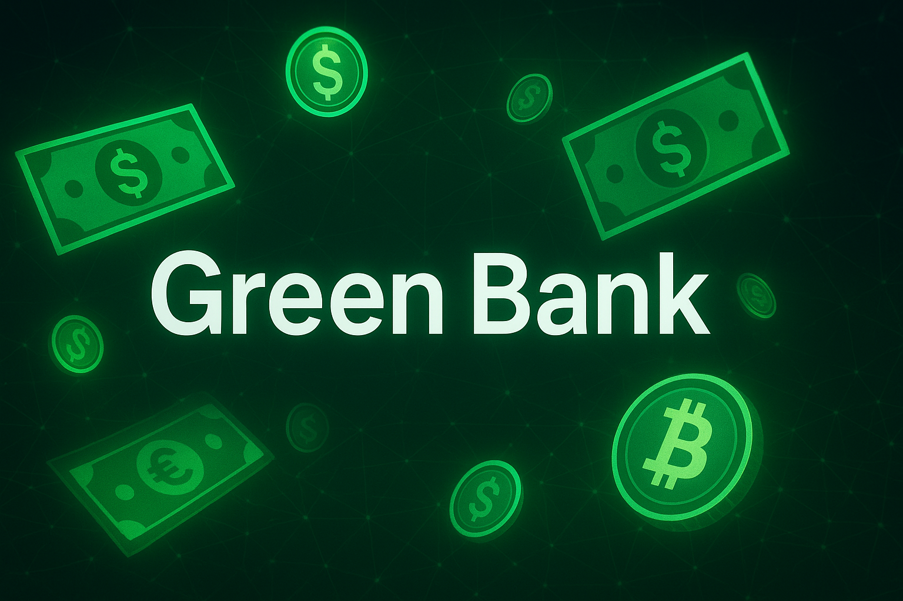

# Welcome to Green Bank project (python):

This project is a simplified banking system developed using Python, featuring key functionalities such as creating accounts, transferring funds, withdrawing, and depositing money.

## Technologies used:
- **Python 3**: The mine programming language.
- **CSV Module**: Storing & retrieving account data.
-  **Rich**:Library to stayle text in the CLI .
- **Colorama**" Library Adds color formatting capabilities to text in the CLI.
- **Time**: Library to loading in the CLI.
 
## The library used for formatting:
- [Colorama](https://pypi.org/project/colorama/)
- [Rich](https://github.com/Textualize/rich)
- [Rich_Time](https://rich.readthedocs.io/en/stable/progress.html)
  
## Functionality:	
<table style="align: left; width: 100%; max-width: fit-content;">
    <table>
  <tr>
    <th>Process</th>
    <th>Features</th>
  </tr>
  <tr>
    <td>Account Creation</td>
    <td>Create checking, savings, or both with initial deposit</td>
  </tr>
  <tr>
    <td>Login</td>
    <td>User ID + password authentication</td>
  </tr>
  <tr>
    <td>Transactions</td>
    <td>Deposit, withdraw, transfer between accounts or to another user</td>
  </tr>
  <tr>
    <td>Overdraft Protection</td>
    <td>Limit to -$100, $35 fee when exceeded</td>
  </tr>
</table>

## Challenges:
- The minimum account balance is $100, excluding tax (tax is an additional $25).
- The system processes transactions smoothly, even with a high volume of overlapping transactions.
- I use similar classes, but they are not identical in their properties.
- I handle data in CSV format, updating and linking it to facilitate data transfer between clients.

## In the features: 
* Admin Acccount.
* Cloud data saving. 
* Dark/light mode. 
* Clear interface.
* More language.

##### Thank you i hope you like it ✨
